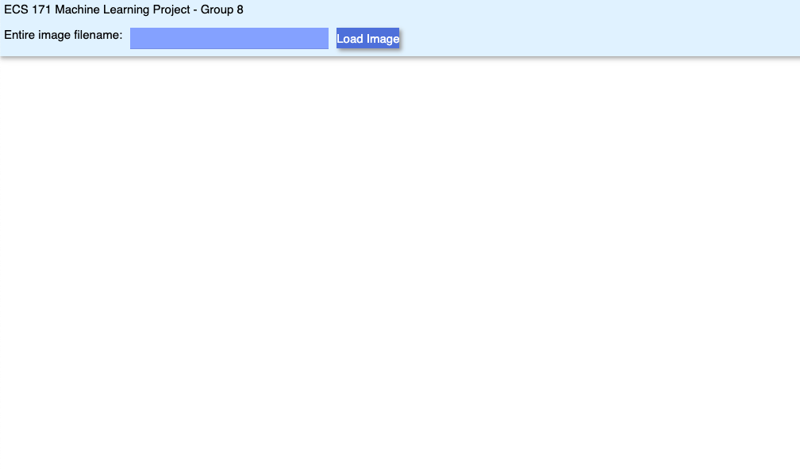
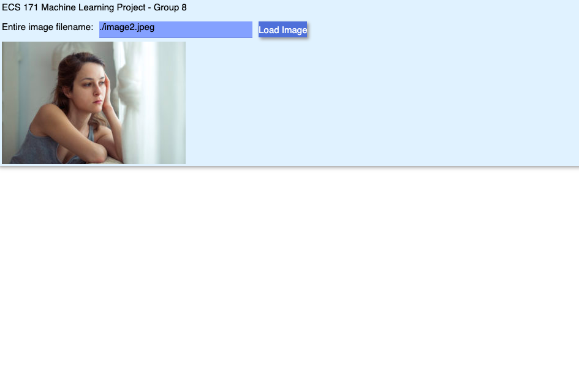

# image-upload version of the gui

- currently only a textbox and button that displays the inputted image on the page
- pretty much plagiarizing https://www.blog.pythonlibrary.org/2021/02/16/creating-an-image-viewer-with-pysimplegui/ at this point but when we add more things it'll be ok

must install pysimpleguiweb with `pip install pysimpleguiweb` prior to running

running `python3 gui.py` will open a tab in your browser displaying the interface.
enter `./image1.jpeg` or the path of any image file in the textbox and click the `load image` button to display the image on the page.

# preview of what we have rn

