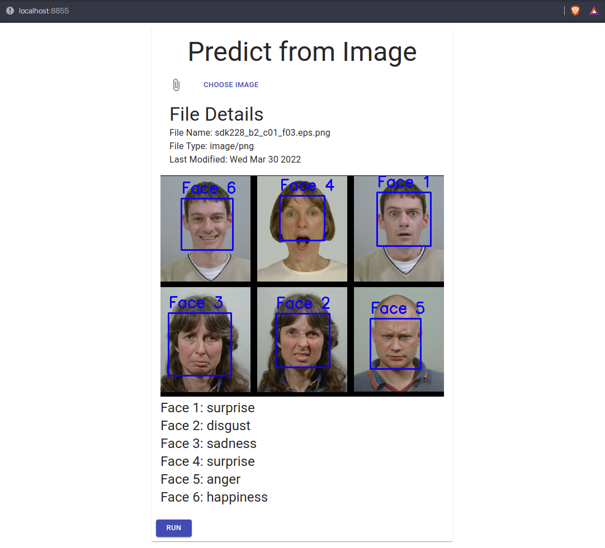

# Preview




# Introduction

This project is able to predict human emotion by receiving an input image. It was created by group of students at University of California, Davis.

## Data set

[kaggle.com/deadskull7/fer2013](https://kaggle.com/deadskull7/fer2013)


## Brief description

 * anger, disgust, fear, happiness, sadness, surprise, and neutral
 * 35887 data entries: 80% training, 10% validating, 10% testing

# Static Demo

## Install Static Demo Dependencies
Make sure you are in the [static_demo](./static_demo) directory, then install all the necessary modules with

```console
pip install -r requirements.txt
```

If on Mac, make sure you are using python 3 as default or use pip3 instead

## Run Static Demo

Once you have installed all the required modules, you can run the server with

```console
python -m main
```

## Access Static Demo

Once the server is successfully running, you can access the web app on [localhost:8855](http://localhost:8855) using your web browser.

# Live Demo

## Install Live Demo Dependencies
Make sure you are in the [live_demo](./live_demo) directory, then install all the necessary modules with

```console
pip install -r requirements.txt
```

If on Mac, make sure you are using python 3 as default or use pip3 instead

## Run and Access Live Demo

Once you have installed all the required modules, you can run the server with

```console
python -m main
```
